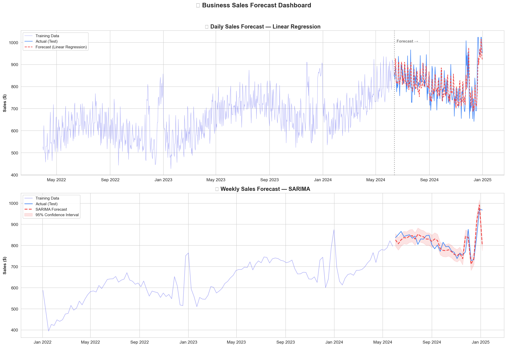
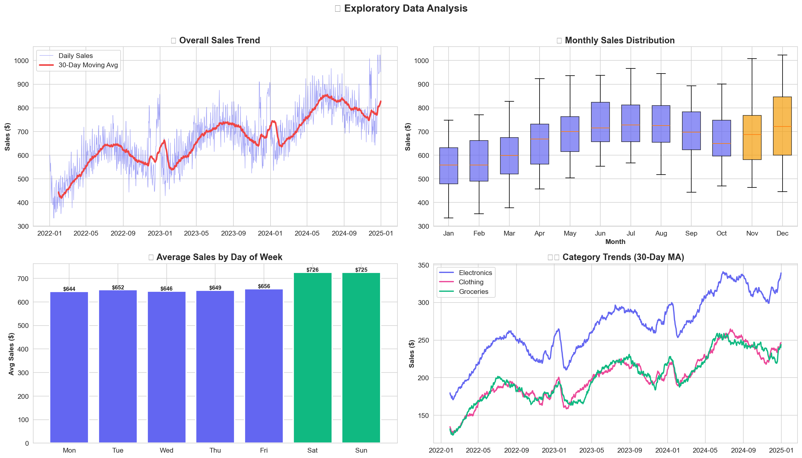
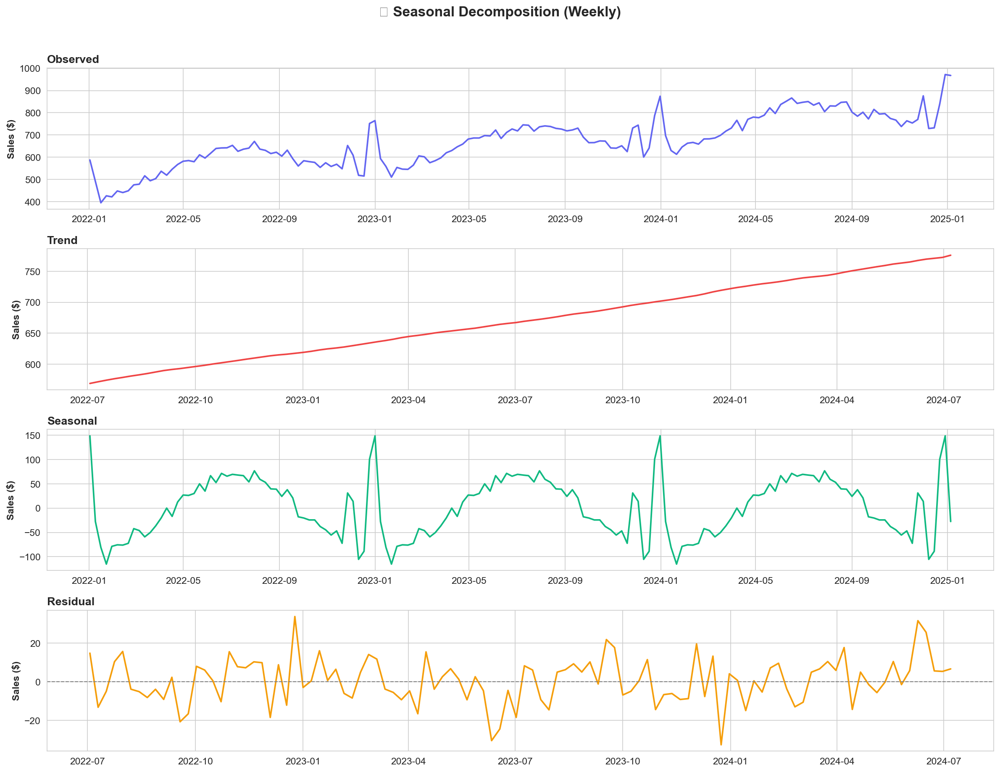
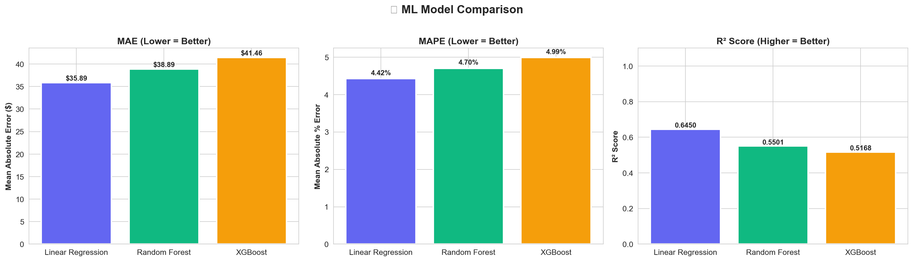
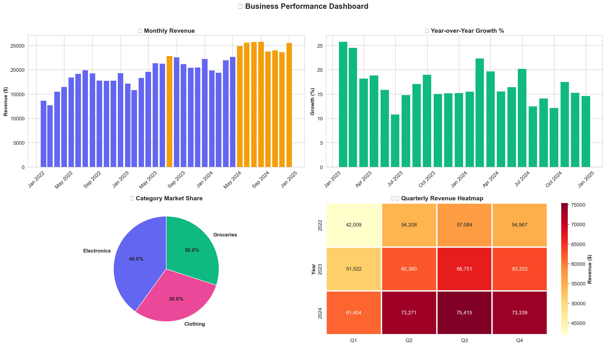
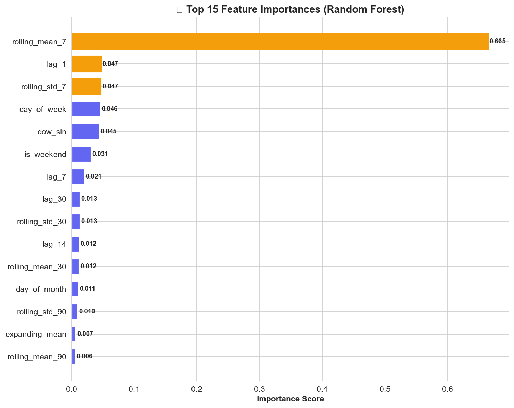

# 📈 Sales & Demand Forecasting for Businesses

A comprehensive sales forecasting system built with Python that predicts future sales using historical retail data. The project implements multiple ML and time-series models, performs detailed exploratory analysis, and delivers business-ready visual dashboards with actionable insights.



---

## 🎯 Objective

Predict future sales or demand based on past data and present results in a clear, business-friendly way. This project demonstrates how Machine Learning supports real business decisions like:

- 📦 **Inventory Planning** — Know what to stock and when
- 💰 **Cash Flow Management** — Anticipate revenue trends
- 👥 **Staffing Optimization** — Schedule based on demand patterns
- 📉 **Loss Prevention** — Avoid overstocking or understocking

---

## 🏗️ Project Structure

```
sales_demand_forecasting/
├── README.md                                    # Project documentation
├── requirements.txt                             # Python dependencies
├── sales_demand_forecasting.ipynb               # Source notebook
├── sales_demand_forecasting_executed.ipynb       # Executed notebook with all outputs
└── outputs/                                     # Generated visualizations
    ├── eda_dashboard.png                        # Exploratory Data Analysis
    ├── seasonal_decomposition.png               # Time-series decomposition
    ├── model_comparison.png                     # ML model performance comparison
    ├── forecast_dashboard.png                   # Business forecast dashboard
    ├── feature_importance.png                   # Feature importance chart
    └── business_insights.png                    # Revenue & business metrics
```

---

## 📊 Notebook Sections

The Jupyter notebook contains **12 structured sections** covering the full ML pipeline:

| #   | Section                          | Description                                                                                                                |
| --- | -------------------------------- | -------------------------------------------------------------------------------------------------------------------------- |
| 1   | **Imports & Setup**              | Library imports, plotting configuration, color palette                                                                     |
| 2   | **Synthetic Dataset Generation** | 3 years (2022–2024) of daily retail sales with trend, seasonality, weekly cycles, holiday spikes, and 3 product categories |
| 3   | **Data Cleaning**                | Missing value imputation (forward-fill), outlier detection & capping (IQR method)                                          |
| 4   | **Exploratory Data Analysis**    | 4-panel dashboard — sales trend with 30-day MA, monthly distribution, day-of-week patterns, category trends                |
| 5   | **Seasonal Decomposition**       | Additive decomposition into trend, seasonal, and residual components                                                       |
| 6   | **Feature Engineering**          | 25+ features — calendar, cyclical sin/cos, lag (1/7/14/30 days), rolling stats (7/30/90-day), expanding mean               |
| 7   | **ML Forecasting Models**        | Linear Regression, Random Forest, XGBoost with chronological 80/20 split                                                   |
| 8   | **SARIMA Model**                 | SARIMA(1,1,1)(1,1,1,52) on weekly-resampled data with confidence intervals                                                 |
| 9   | **Model Comparison**             | Side-by-side MAE, MAPE, R² bar charts across all ML models                                                                 |
| 10  | **Forecast Dashboard**           | Daily ML forecast + weekly SARIMA forecast with 95% confidence bands                                                       |
| 11  | **Feature Importance**           | Top 15 Random Forest feature importances                                                                                   |
| 12  | **Business Insights**            | Monthly revenue, YoY growth, category market share, quarterly heatmap, and actionable recommendations                      |

---

## 📈 Generated Visualizations

### EDA Dashboard

4-panel analysis showing sales trends, monthly distributions, day-of-week patterns, and category breakdowns.



### Seasonal Decomposition

Breaking down weekly sales into trend, seasonal, and residual components.



### Model Comparison

Performance metrics (MAE, MAPE, R²) across Linear Regression, Random Forest, and XGBoost.



### Business Performance Dashboard

Monthly revenue bars, year-over-year growth, category market share pie chart, and quarterly revenue heatmap.



### Feature Importance

Top features driving the Random Forest model predictions.



---

## 🤖 Models & Results

| Model                 | MAE ($) | MAPE (%) | R² Score |
| --------------------- | ------- | -------- | -------- |
| **Linear Regression** | ~$35.89 | 4.42%    | 0.645    |
| Random Forest         | ~$38.89 | 4.70%    | 0.550    |
| XGBoost               | ~$41.46 | 4.99%    | 0.517    |
| SARIMA (Weekly)       | —       | —        | —        |

> **Best Model**: Linear Regression achieved the lowest MAPE (4.42%), meaning predictions are on average within ~4.4% of actual sales.

---

## 🛠️ Tech Stack

| Category             | Tools                                        |
| -------------------- | -------------------------------------------- |
| **Language**         | Python 3.x                                   |
| **Data Processing**  | Pandas, NumPy                                |
| **Machine Learning** | Scikit-learn, XGBoost                        |
| **Time Series**      | Statsmodels (SARIMA, seasonal decomposition) |
| **Visualization**    | Matplotlib, Seaborn                          |
| **Environment**      | Jupyter Notebook                             |

---

## ⚡ Quick Start

### 1. Clone the Repository

```bash
git clone https://github.com/<your-username>/sales_demand_forecasting.git
cd sales_demand_forecasting
```

### 2. Install Dependencies

```bash
pip install -r requirements.txt
```

### 3. Run the Notebook

```bash
jupyter notebook sales_demand_forecasting.ipynb
```

Or execute all cells from the command line:

```bash
jupyter nbconvert --to notebook --execute sales_demand_forecasting.ipynb --output sales_demand_forecasting_executed.ipynb
```

---

## 🔧 Dataset Details

The project uses a **synthetic retail sales dataset** generated within the notebook for full reproducibility:

- **Period**: January 2022 – December 2024 (1,096 days)
- **Frequency**: Daily
- **Components**:
  - 📈 **Trend**: Linear growth from $500/day to $800/day
  - 🔄 **Seasonality**: Annual cycle (peaks in Nov–Dec for holidays)
  - 📅 **Weekly Pattern**: Weekend sales ~12% higher than weekdays
  - 🎄 **Holiday Spikes**: Black Friday (+$200), Christmas (+$250), New Year (+$100)
  - 📊 **Noise**: Gaussian random fluctuations (σ = $40)
- **Categories**: Electronics (~40%), Clothing (~30%), Groceries (~30%)
- **Missing Values**: ~2% injected for realism

---

## 🔍 Feature Engineering

The model uses **25+ engineered features** across four categories:

| Category     | Features                                                                                  |
| ------------ | ----------------------------------------------------------------------------------------- |
| **Calendar** | year, month, day_of_week, day_of_month, quarter, is_weekend, is_month_start, is_month_end |
| **Cyclical** | month_sin, month_cos, dow_sin, dow_cos                                                    |
| **Lag**      | lag_1, lag_7, lag_14, lag_30                                                              |
| **Rolling**  | rolling_mean_7/30/90, rolling_std_7/30/90, expanding_mean                                 |

---

## 💡 Key Business Insights

1. **📦 Inventory**: Stock 15–20% more during Nov–Dec for holiday demand surges
2. **👥 Staffing**: Schedule extra weekend staff (sales ~12% higher)
3. **💰 Pricing**: Consider dynamic pricing during peak seasons
4. **📊 Forecasting**: Use rolling 30–60 day forecasts for operational planning
5. **🎯 Categories**: Electronics leads revenue at ~40% market share — prioritize marketing

---

## 🧠 Skills Demonstrated

- Time-series analysis & forecasting
- Data cleaning & preprocessing
- Feature engineering (temporal, cyclical, lag, rolling)
- Multiple ML model training & comparison
- Classical time-series modeling (SARIMA)
- Model evaluation (MAE, RMSE, MAPE, R²)
- Business-friendly data visualization
- Actionable insight generation

---

## 📄 License

This project is open source and available under the [MIT License](LICENSE).

---

## 🤝 Contributing

Contributions are welcome! Feel free to open issues or submit pull requests for improvements.

---

<p align="center">
  Built with ❤️ using Python, Scikit-learn, XGBoost & Statsmodels
</p>
